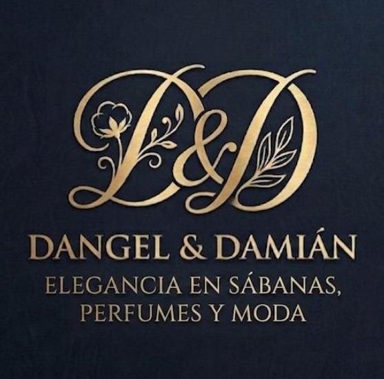

# Dangel & Damián Store 🌟

> **Elegancia en Sábanas, Perfumes y Moda**  
> Landing page informativa y de alto impacto visual para el negocio Dangel & Damián Store — Venezuela 2026.

---

## Vista Previa



---

## 📋 Descripción

**Dangel & Damián Store** es una landing page estática, moderna y de diseño premium, pensada para presentar la identidad de marca y los productos ofrecidos: sábanas de lujo, perfumes icónicos y moda exclusiva.

No es una tienda en línea con carrito de compras; su objetivo es **captar la atención del visitante** y dirigirlo a una consulta directa por **WhatsApp**.

---

## ✨ Características

- 🎨 **Diseño luxury** con paleta Navy `#0d1526` + Dorado `#c9a84c` extraída del logo corporativo
- 📱 **Totalmente responsivo** — mobile, tablet y desktop
- ⚡ **Sin dependencias externas** — HTML, CSS y JavaScript puro (Vanilla)
- 🌀 **Animaciones premium**: partículas flotantes, efecto parallax en el hero, reveal on scroll, glow animado
- 💬 **6 puntos de contacto WhatsApp** con mensajes pre-escritos por categoría
- 🏷️ **SEO básico** integrado: meta title, meta description, semántica HTML5
- 🔭 **Sección de marcas** con pestañas interactivas (Hogar · Perfumes · Moda)
- 🪄 **Botón flotante** de WhatsApp con efecto pulse

---

## 🗂️ Estructura del Proyecto

```
dangel-damian-store/
├── index.html      # Estructura principal de la landing page
├── style.css       # Estilos (sistema de diseño completo, tokens CSS)
├── script.js       # Interacciones: navbar, tabs, animaciones, parallax
├── logo.jpg        # Logo oficial del negocio
├── images/         # Carpeta para recursos adicionales
├── README.md       # Este archivo
└── AGENTS.md       # Guía para agentes de IA que modifiquen el proyecto
```

---

## 🚀 Uso

### Abrir localmente

Simplemente abre `index.html` en cualquier navegador moderno:

```bash
# Opción 1 — doble clic en index.html

# Opción 2 — servidor local con Node.js
npx serve .

# Opción 3 — Live Server (VS Code Extension)
# Click derecho en index.html → "Open with Live Server"
```

### Publicar en GitHub Pages

```bash
git add .
git commit -m "feat: initial landing page"
git push origin main
```

Luego en GitHub → Settings → Pages → Branch: `main` / Root `/`.

---

## 📐 Sistema de Diseño

### Paleta de Colores

| Token            | Valor         | Uso                          |
|------------------|---------------|------------------------------|
| `--navy-deep`    | `#080e1c`     | Fondo más oscuro             |
| `--navy`         | `#0d1526`     | Fondo principal              |
| `--navy-light`   | `#1a2a4a`     | Tarjetas, cards              |
| `--gold`         | `#c9a84c`     | Color de acento principal    |
| `--gold-light`   | `#e0c06a`     | Hover, degradados            |
| `--gold-dark`    | `#a07830`     | Énfasis, sombras doradas     |
| `--cream`        | `#f5efe0`     | Texto principal              |
| `--cream-dim`    | `#d4c9af`     | Texto secundario             |

### Tipografía

| Familia                  | Uso                          |
|--------------------------|------------------------------|
| `Cormorant Garamond`     | Títulos y headings (serif)   |
| `Montserrat`             | Cuerpo de texto, UI (sans)   |

---

## 📌 Secciones

| ID            | Sección          | Descripción                                              |
|---------------|------------------|----------------------------------------------------------|
| `#hero`       | Hero             | Presentación principal con logo, título y CTAs           |
| `#nosotros`   | Nosotros         | Historia y valores de la marca                           |
| `#categorias` | Categorías       | Sábanas, Perfumes, Moda — con botones de consulta        |
| `#marcas`     | Marcas Top 2026  | Pestañas interactivas con 18 marcas premium              |
| `#contacto`   | Contacto         | Información de contacto y tarjeta de presentación        |

---

## 📞 Contacto del Negocio

| Canal       | Información                                                                 |
|-------------|-----------------------------------------------------------------------------|
| WhatsApp    | [+58 424-3752134](https://wa.me/584243752134)                               |
| País        | Venezuela 🇻🇪                                                               |

---

## 🛠️ Tecnologías

- **HTML5** — Semántica moderna
- **CSS3** — Custom Properties, Grid, Flexbox, Animations, `backdrop-filter`
- **JavaScript ES6+** — IntersectionObserver, eventos, DOM manipulation
- **Google Fonts** — Cormorant Garamond + Montserrat

---

## 📄 Licencia

Proyecto privado — © 2026 **Dangel & Damián Store**. Todos los derechos reservados.
